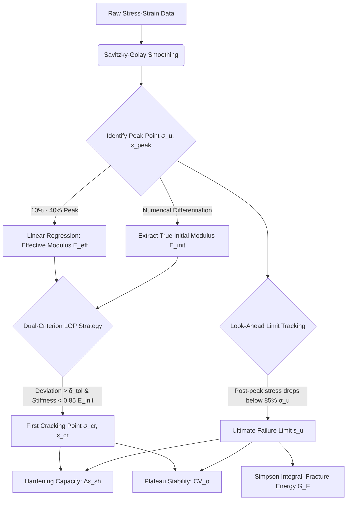

# 🏗️ ECC Analyzer Pro - Scientific Edition

<div align="center">


An automated, physics-informed scientific tool for characterizing tensile & compressive properties of Engineered Cementitious Composites (ECC/SHCC).

专为 ECC/SHCC 材料研发的自动化科研分析工具——拒绝暴力拟合，回归物理本真。

[Download](#-下载与安装-download) • [Scientific Core](#-核心算法物理驱动的本构解析-scientific-core) • [Data Protocol](#-数据格式规范-data-protocol) • [Citation](#-引用-citation)

</div>

---

## 💡 设计哲学 (Design Philosophy)

> ECC Analyzer Pro 不试图讨好所有材料，也不假装 ECC 是“近似线弹性”的乖孩子。相反，它非常直接地承认一个事实：ECC 从第一步加载开始，就是非线性的。

既然如此，就不该用一个“唯一模量”去强行解释它，也不该用肉眼去猜测“哪一点是开裂点”。本软件的核心使命，是将 **“经验判断”** 转化为 **“可复现的数学判据”**。

---


### 1️⃣ 全局控制 (Global Control)
* **Mode Selector**: `Tensile` / `Compressive` 双模式一键切换。
* **View Switcher**: `Basic` (工程指标) / `Advanced` (科研指标) 视图切换。

### 2️⃣ 智能数据面板 (Smart Data Panel)
* **Drag & Drop**: 支持批量拖拽 `.xlsx` / `.csv` 文件。
* **Smart Selection**: 交互式勾选，支持 Shift 连选，实时显示选中样本统计值。

### 3️⃣ 可视化引擎 (Visualization Engine)
* **Dual Canvas**: 左侧 `Statistics` (带误差棒的柱状图)，右侧 `Curves` (高质量曲线叠加)。
* **Interaction**: 鼠标悬停显示精确坐标，支持右键一键复制图表到论文。

---

## 🔬 核心算法：物理驱动的本构解析 (Scientific Core)

超越传统唯象拟合的局限，本工具搭载了强大的物理信息驱动解析引擎。以下是核心算法处理数据流的架构：


### 1. 双模量策略 (Dual-Modulus Strategy)
* **有效弹性模量 ($E_{\mathrm{eff}}$)**：在用户可配的应力区间（默认 10%–40% 峰值）内，采用最小二乘法进行线性回归计算割线响应。作为工程设计的宏观刚度输入。
* **初始弹性模量 ($E_{\mathrm{init}}$)**：对平滑后的应力-应变曲线进行数值微分，提取无损伤基体的真实极值刚度。

### 2. 首裂判据：主辅耦合机制 (Dual-Criterion LOP)
单纯的绝对容差容易受噪音干扰，本工具采用多重耦合判据确认开裂：
* **主判据 - 线性偏离**：当实验应力显著偏离 $E_{\mathrm{eff}}$ 预测轨迹时触发：
  $$\sigma_{\mathrm{theory}} - \sigma_{\mathrm{exp}} > \delta_{\mathrm{tol}}$$
* **辅判据 - 刚度衰减**：实时切线模量实质性退化至 $0.85 \cdot E_{\mathrm{init}}$ 以下：
  $$E_{\mathrm{tan}} \le 0.85 \cdot E_{\mathrm{init}}$$

### 3. 宏观失效与能量量化 (Failure & Energy)
* **前瞻极限追踪 (Look-Ahead Limit Tracking)**：自动向下寻找应力跌破 85% 峰值的物理坐标，提取真实的失效极限应变 $\varepsilon_u$，避免锯齿波动引起的早期误判。
* **多缝硬化容量 ($\Delta \varepsilon_{\mathrm{sh}}$)**：精准剥离基体弹性变形，纯粹量化材料稳定开裂的能力：
  $$\Delta \varepsilon_{\mathrm{sh}} = \varepsilon_u - \varepsilon_{\mathrm{cr}}$$
* **断裂能 ($G_F$)**：基于 Simpson 积分和实测标距 ($L_0$) 计算总能量耗散：
  $$G_F = L_0 \int_{0}^{\varepsilon_u} \sigma(\varepsilon) \, d\varepsilon$$

---

## 📂 数据格式规范 (Data Protocol)

程序核心逻辑基于“列对 (Column Pairs)”或“行式 (Row-Based)”读取数据。建议前往 `raw_data` 示例目录下载对应的 Demo 文件，直接替换数据使用。

### 1. 抗拉模式 (Tensile Mode)
每两列为一组（Strain + Stress），程序会自动忽略空列。

| A (Sample 1) | B | C (Sample 2) | D | ... |
| :--- | :--- | :--- | :--- | :--- |
| FSC-AIR-1 | *(Empty)* | FSC-AIR-2 | *(Empty)* | ... |
| *Strain (%)* | *Stress (MPa)* | *Strain (%)* | *Stress (MPa)* | ... |
| 0.001 | 0.05 | 0.002 | 0.04 | ... |

### 2. 抗压模式 (Compressive Mode)
支持全曲线解析或行式批量录入。

| A (Group Name) | B (Val 1) | C (Val 2) | D (Val 3) | ... |
| :--- | :--- | :--- | :--- | :--- |
| ECC-M45 | 45.2 | 46.8 | 44.9 | ... |

---

### 🛠️ 安装与使用 (Installation)

**安装依赖**：
```bash
pip install -r requirements.txt
```

**启动程序**：
```bash
python main.py
```

---

## 📊 指标解读 (Metrics Explained)

### 🧶 Tensile Metrics (抗拉指标)

| Symbol | Definition & Significance |
| :---: | :--- |
| $E_{\mathrm{eff}}$ | **Effective Modulus (有效刚度)**。结构设计的刚度输入。 |
| $\sigma_{\mathrm{cr}}$ | **First Crack Strength (初裂强度)**。比例极限，标志纤维桥接激活。 |
| $\sigma_u$ | **Ultimate Strength (极限强度)**。材料承受的最大拉应力。 |
| $\varepsilon_{\mathrm{tu}}$ | **Ultimate Strain (峰值应变)**。峰值应力对应的延性指标。 |
| $\Delta\varepsilon_{\mathrm{sh}}$ | **Hardening Capacity (硬化容量)**。纯塑性多缝开展区间。 |
| $G_F$ | **Fracture Energy (断裂能)**。耗散能量密度，用于数值模拟标定。 |
| $CV_{\sigma}$ | **Plateau Stability (平台稳定性)**。变异系数越低，裂缝控制越均匀。 |

### 🧱 Compressive Metrics (抗压指标)

| Symbol | Definition & Significance |
| :---: | :--- |
| $\sigma_{\mathrm{mean}}$ | **Mean Strength (平均强度)**。抗压承载力的核心均值。 |
| $SD$ | **Standard Deviation (标准差)**。量化强度的绝对离散程度。 |
| $CV$ | **COV (%) (变异系数)**。表征相对稳定性，通常要求 $CV < 15\%$。 |

---

## ⚙️ 参数配置 (Configuration)

软件内置极客级的双层配置系统，点击界面上的 `⚙️ Settings` 可调整核心物理参数。高级用户亦可直接修改根目录生成的 `.ecc_analyzer_config.json`。

| 核心参数 | 默认值 | 物理意义与建议 |
| :--- | :--- | :--- |
| **Gauge Length** | 80.0 mm | **至关重要**。直接影响断裂能 ($G_F$) 的积分缩放，请按实测标距填写。 |
| **Crack Tolerance** | 0.05 MPa | 首裂线性偏离主判据。若实验噪点极大，可适当调高。 |
| **Ultimate Ratio** | 0.85 | 失效判据 ($\gamma$)。峰后应力降至峰值的 85% 视为发生宏观断裂。 |
| **Smooth Window** | 11 | 数值微分平滑窗口。必须为奇数。数值越大对初始模量提取越平滑。 |

---

## 🖊️ 引用 (Citation)

本项目由中山大学 (Sun Yat-sen University) 的 Li Qing 开发。如果您在学术研究中使用了本软件或其 **“双判据主从制算法”**，请引用：

> Li, Q. (2026). *ECC Analyzer Pro: An automated scientific tool for characterizing tensile properties of Engineered Cementitious Composites based on dual-criterion strategy*. [Software]. Sun Yat-sen University. Available at: https://github.com/liqinglq666/ECC_Analyzer_Pro

```bibtex
@software{ECC_Analyzer_Pro,
  author = {Li, Qing},
  title = {ECC Analyzer Pro: An automated scientific tool for characterizing tensile properties of Engineered Cementitious Composites},
  year = {2026},
  publisher = {GitHub},
  journal = {GitHub repository},
  url = {[https://github.com/liqinglq666/ECC_Analyzer_Pro](https://github.com/liqinglq666/ECC_Analyzer_Pro)}
}
```