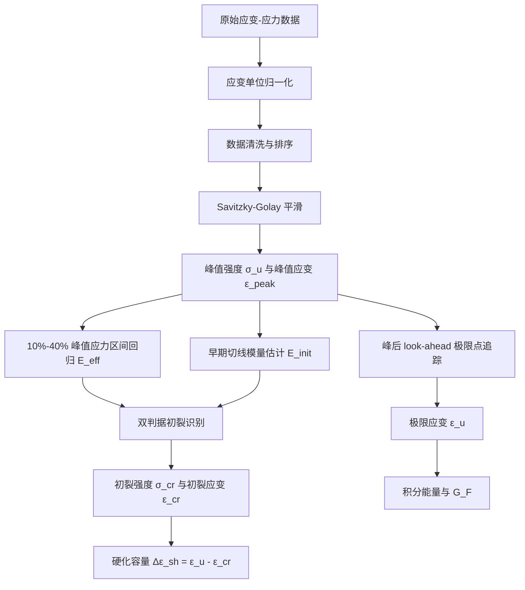

# ECC Analyzer Pro

<div align="center">


**一个面向 ECC / SHCC 拉伸与抗压试验数据的科研分析小工具。**

它不是为了做一个“万能材料软件”，而是为了解决我自己在整理 ECC 试验数据时反复遇到的几个麻烦：曲线太多、初裂点难统一、应变单位容易混、抗压负号很烦、导出结果不够规范。

[快速开始](#快速开始) · [数据格式](#数据格式) · [计算逻辑](#计算逻辑) · [界面说明](#界面说明) · [用户指南](USER_GUIDE.md)

</div>

---

## 项目定位

`ECC Analyzer Pro` 是一个个人开发的研究型桌面软件，主要服务于 ECC / SHCC 材料的力学试验数据处理。

目前它重点支持两类数据：

1. **抗拉 stress-strain 曲线**：自动识别初裂强度、峰值强度、峰值应变、极限应变、硬化容量和能量指标；
2. **抗压强度或抗压曲线**：支持完整曲线，也支持“组名 + 多个强度值”的汇总表。

我希望它最终扮演的角色不是替代 Origin、Excel 或商业试验软件，而是作为一个更贴近 ECC 论文数据处理流程的 `analysis assistant`：把重复性强、容易主观判断的部分尽量自动化、可复现化。

---

## 快速开始

### 1. 安装依赖

```bash
python -m pip install -r requirements.txt
```

如果你使用 conda 环境，例如我的习惯是：

```bash
conda activate ecc_sim
python -m pip install -r requirements.txt
```

### 2. 启动软件

```bash
python main.py
```

当前正式运行入口是：

```text
main.py → app/ui/main_window_active.py
```

`app/ui/main_window.py` 保留为基础窗口实现，当前真正对用户生效的 UI 行为集中在 `main_window_active.py` 中维护。这样后续修改 UI 时，不会再出现“patch 文件才是真入口”的混乱情况。

### 3. 运行核心测试

```bash
python scripts/smoke_test.py
```

这个测试不会打开 GUI，只检查核心分析模块能否正常导入和计算。看到下面输出即可：

```text
Smoke test passed.
```

---

## 我为什么做这个工具

做 ECC 数据处理时，最容易出问题的不是“会不会画图”，而是下面这些细节：

- 有些 Excel 里 `0.5` 表示 `0.5%`，有些 DIC 数据里 `0.005` 才表示 `0.5%`；
- 首裂点如果靠肉眼点，换一个人、换一天可能就不一样；
- ECC 的峰值应变和峰后极限应变不是同一个概念，但很多表格会混着写；
- 抗压试验机常把压力记成负数，后处理时很容易忘记取绝对值；
- 导出 Excel 如果目标文件正打开，程序不应该假装成功。

所以这个项目的核心思路是：**把容易主观、容易混乱的步骤写成明确规则，并且让规则可以配置。**

---

## 数据格式

### 抗拉数据：两列一组

每个试件建议使用相邻两列：第一列应变，第二列应力。

| A | B | C | D |
|---|---:|---|---:|
| FSC-AIR-1 |  | FSC-AIR-2 |  |
| Strain (%) | Stress (MPa) | Strain (%) | Stress (MPa) |
| 0.000 | 0.00 | 0.000 | 0.00 |
| 0.050 | 1.20 | 0.048 | 1.15 |
| 0.100 | 1.75 | 0.096 | 1.70 |
| 0.500 | 2.20 | 0.510 | 2.10 |

程序会自动寻找数值开始行，并尽量把数值行上方的有效文本识别为样品名。

### 抗压数据：汇总强度表

如果你已经有每个试件的峰值抗压强度，可以用这种格式：

| Group | Test 1 | Test 2 | Test 3 |
|---|---:|---:|---:|
| ECC-M45 | 45.2 | 46.8 | 44.9 |
| ECC-M60 | 58.5 | 61.2 | 59.7 |

也支持 `Stress / Strength / 应力 / 强度` 作为表头关键词。

### 抗压数据：完整曲线

完整抗压曲线也可以用“两列一组”的方式。负号抗压应力默认会被转成正的强度大小。

---

## 应变单位逻辑

这是本软件目前最重要的设置之一。

在 **Settings → Input Strain Unit** 中有三种模式：

| 模式 | 适用情况 | 示例 |
|---|---|---|
| `Auto` | 不确定单位，交给阈值自动判断 | 默认阈值 0.2 |
| `Percent` | Excel 表头写 `Strain (%)` | `0.5` 表示 `0.5%` |
| `Decimal` | DIC 或程序导出小数应变 | `0.005` 表示 `0.5%` |

默认 `Auto Percent Threshold = 0.2`。在 Auto 模式下：

- `0.5` 会被判断为百分数，应变内部转为 `0.005`；
- `0.005` 会被保留为小数应变。

但我个人更建议：如果你的表头明确写了 `%`，直接选 **Percent**，不要完全依赖 Auto。

---

## 计算逻辑



### 1. 有效模量 `E_eff`

默认在峰值应力的 10%–40% 区间做线性回归，用来表征工程意义上的有效刚度。

### 2. 初始模量 `E_init`

对早期切线模量进行统计提取，主要用于辅助判断初裂，而不是简单取第一个点附近的斜率。

### 3. 初裂强度 `σ_cr`

初裂不是单一阈值判断，而是同时满足：

```text
线性偏离 > max(CRACK_TOLERANCE_BASE, CRACK_TOLERANCE_RATIO × σ_u)
切线刚度 < CRACK_STIFFNESS_CONSTRAINT × E_init
当前应力 > CRACK_MIN_STRESS_RATIO × σ_u
```

这个设计是为了减少噪声点导致的误判。

### 4. `ε_peak` 与 `ε_u`

这两个量必须分开：

- `ε_peak`：峰值应力 `σ_u` 对应的应变；
- `ε_u`：峰后应力持续跌落到设定比例后的极限/失效应变。

ECC 有明显的多缝开展和纤维桥接过程，峰值点不一定等于真正的极限变形点。

### 5. 能量指标

软件会对 `0 → ε_u` 的应力-应变曲线做 Simpson 积分，并结合标距 `L0` 给出一个断裂能相关指标：

```text
G_F = L0 × ∫σ(ε)dε
```

这里的 `G_F` 更适合作为同一套试验流程下的对比指标，而不是不加条件地等同于所有断裂力学语境下的材料常数。

---

## 界面说明

### 顶部区域

- `Mode`：选择 Tensile 或 Compressive；
- `Basic Results`：显示常用工程指标；
- `Advanced Analysis`：显示更偏科研解释的指标；
- `Export`：导出当前勾选样品；
- `Settings`：修改单位、初裂、模量、极限点、绘图参数；
- `Clear`：清空当前数据。

### Basic Results

抗拉 Basic 表格现在显示 5 个指标：

| 指标 | 含义 |
|---|---|
| `E_eff` | 有效模量 |
| `σ_cr` | 初裂强度 |
| `σ_u` | 峰值拉伸强度 |
| `ε_peak` | 峰值应变 |
| `ε_u` | 峰后极限应变 |

### Advanced Analysis

| 指标 | 含义 |
|---|---|
| `E_init` | 初始切线模量估计 |
| `G_F` | 标距换算后的能量指标 |
| `Δε_sh` | 应变硬化容量 |
| `CV_σ` | 硬化平台稳定性 |

---

## 导出说明

导出的抗拉 Excel 会包含：

```text
E_eff, σ_cr, σ_u, ε_peak, ε_u, E_init, E_v, G_F, Δε_sh, CV_σ
```

导出的抗压 Excel 会包含：

```text
Sample Group, σ_mean, SD, COV, N
```

如果目标 Excel 文件正在打开，软件会提示导出失败，而不是假装导出成功。

---

## 项目结构

```text
ECC_Analyzer_Pro/
├── main.py                         # 程序入口
├── README.md                       # 项目说明
├── USER_GUIDE.md                   # 更详细的用户指南
├── requirements.txt
├── scripts/
│   └── smoke_test.py               # 核心算法烟雾测试
└── app/
    ├── core/
    │   ├── algorithms.py           # 拉伸/抗压核心算法
    │   ├── physics.py              # 全局配置与默认参数
    │   ├── statistics.py           # 分组统计
    │   └── validators.py           # 数据校验
    ├── data/
    │   ├── loader.py               # Excel/CSV 读取
    │   └── exporter.py             # Excel 导出
    └── ui/
        ├── main_window.py          # 基础窗口实现
        ├── main_window_active.py   # 当前正式运行窗口
        ├── plotting.py             # Matplotlib 绘图
        └── dialogs.py              # Settings 设置窗口
```

---

## 常见问题

### 1. 应变结果大了或小了 100 倍

先检查 **Settings → Input Strain Unit**。如果你的 Excel 表头是 `Strain (%)`，建议选择 `Percent`。

### 2. 抗压值是负数怎么办

不用手动处理。软件默认把抗压负应力转成正的强度大小。

### 3. 导出失败怎么办

先关闭同名 Excel 文件，再重新导出。

### 4. 为什么有 `main_window.py` 和 `main_window_active.py`

`main_window.py` 是基础 UI 实现，`main_window_active.py` 是当前正式运行层。这样可以在不重写整个大窗口文件的情况下，集中维护当前版本真正对用户生效的 UI 行为。

---

## 复现实验建议

如果用于论文或组会汇报，建议同时保存：

- 原始 Excel / CSV；
- 导出的分析结果；
- `~/.ecc_analyzer_config.json`；
- 当前 GitHub commit；
- Settings 中的关键参数截图。

尤其是 `Input Strain Unit`、`Gauge Length`、`Rupture Ratio`、`Crack Tolerance` 这些参数，最好在论文方法部分说明。

---

## 引用方式

如果这个工具对你的研究有帮助，可以按研究软件引用：

```bibtex
@software{ECC_Analyzer_Pro,
  author = {Li, Qing},
  title = {ECC Analyzer Pro: A research-oriented tool for ECC/SHCC tensile and compressive data analysis},
  year = {2026},
  publisher = {GitHub},
  url = {https://github.com/liqinglq666/ECC_Analyzer_Pro}
}
```

---

## 说明

这是一个个人研究过程中逐步打磨出来的工具，目标是让 ECC / SHCC 数据处理更稳定、更透明、更容易复现。它仍然会继续根据真实数据和论文写作需求迭代。欢迎提出 bug、改进建议或新的数据格式需求。
