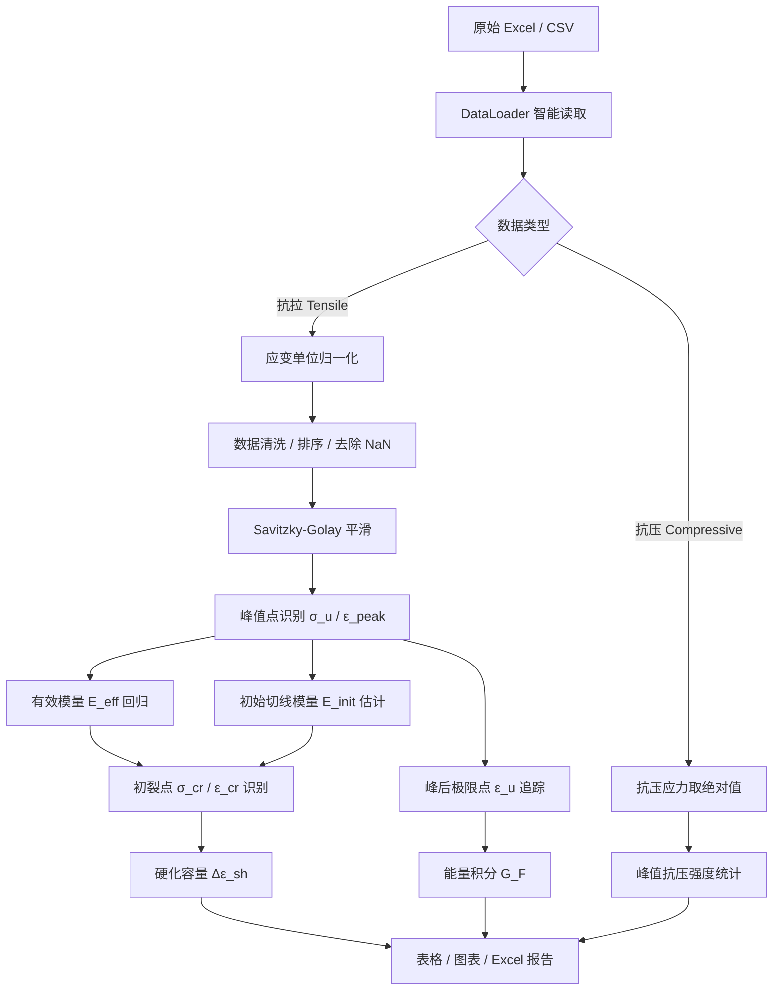
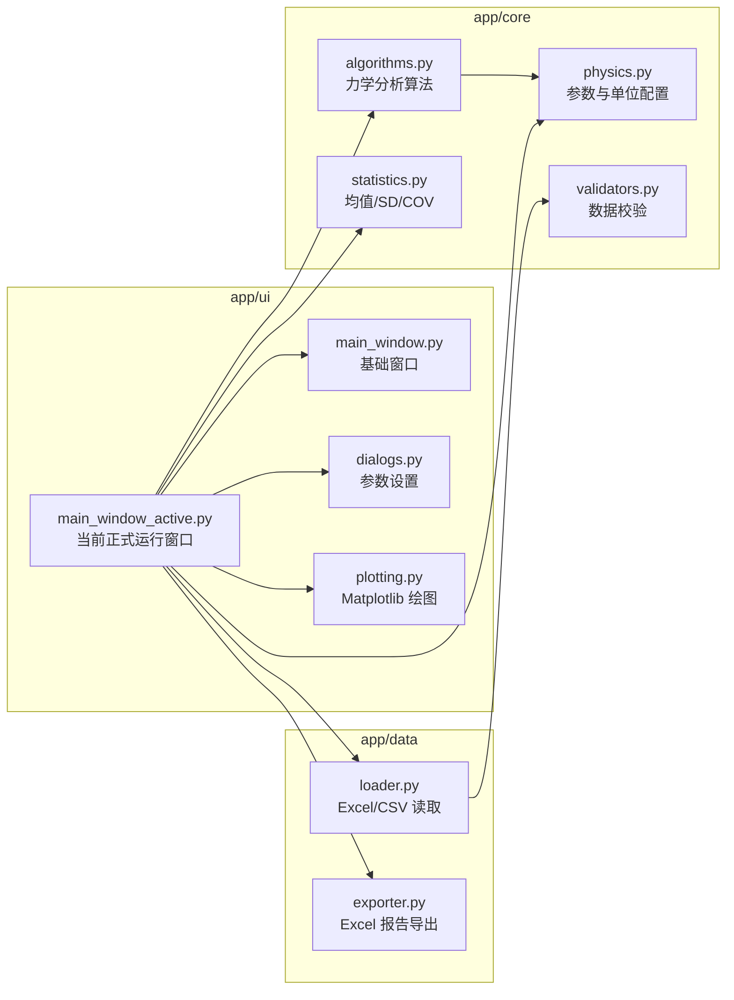
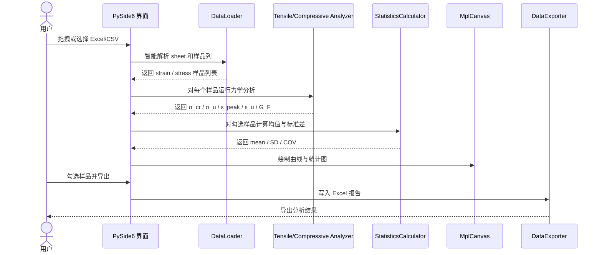
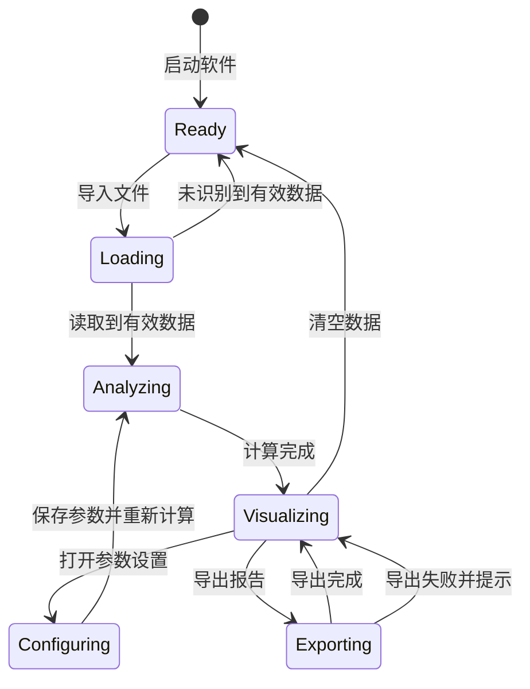

# ECC Analyzer Pro

<div align="center">


**一个面向 ECC / SHCC 拉伸与抗压试验数据的科研分析小工具。**

它不是为了做一个“万能材料软件”，而是为了解决我自己在整理 ECC 数据时反复遇到的几个麻烦：曲线太多、初裂点难统一、应变单位容易混、抗压负号很烦、导出结果不够规范。

[快速开始](#快速开始) · [数据格式](#数据格式) · [计算逻辑与公式](#计算逻辑与公式) · [软件架构](#软件架构) · [界面说明](#界面说明) · [用户指南](USER_GUIDE.md)

</div>

---

## 项目定位

`ECC Analyzer Pro` 是一个个人开发的研究型桌面软件，主要服务于 ECC / SHCC 材料的力学试验数据处理。

目前它重点支持两类数据：

1. **抗拉 stress-strain 曲线**：自动识别初裂强度、峰值强度、峰值应变、极限应变、硬化容量和能量指标；
2. **抗压强度或抗压曲线**：支持完整曲线，也支持“组名 + 多个强度值”的汇总表。

我希望它最终扮演的角色不是替代 Origin、Excel 或商业试验软件，而是作为一个更贴近 ECC 论文数据处理流程的 `analysis assistant`：把重复性强、容易主观判断的部分尽量自动化、可复现化。

---

## 快速开始

### 1. 安装依赖

```bash
python -m pip install -r requirements.txt
```

如果使用 conda 环境，例如我的本地环境是：

```bash
conda activate ecc_sim
python -m pip install -r requirements.txt
```

### 2. 启动软件

```bash
python main.py
```

当前正式运行入口是：

```text
main.py → app/ui/main_window_active.py
```

`app/ui/main_window.py` 保留为基础窗口实现，当前真正对用户生效的 UI 行为集中在 `main_window_active.py` 中维护。这样后续修改 UI 时，不会再出现“改了一个文件，运行时却没变化”的问题。

### 3. 运行核心测试

```bash
python scripts/smoke_test.py
```

这个测试不会打开 GUI，只检查核心分析模块能否正常导入和计算。看到下面输出即可：

```text
Smoke test passed.
```

---

## 我为什么做这个工具

做 ECC 数据处理时，最容易出问题的不是“会不会画图”，而是下面这些细节：

- 有些 Excel 里 `0.5` 表示 `0.5%`，有些 DIC 数据里 `0.005` 才表示 `0.5%`；
- 首裂点如果靠肉眼点，换一个人、换一天可能就不一样；
- ECC 的峰值应变和峰后极限应变不是同一个概念，但很多表格会混着写；
- 抗压试验机常把压力记成负数，后处理时很容易忘记取绝对值；
- 导出 Excel 如果目标文件正打开，程序不应该假装成功。

所以这个项目的核心思路是：**把容易主观、容易混乱的步骤写成明确规则，并且让规则可以配置。**

---

## 数据格式

### 抗拉数据：两列一组

每个试件建议使用相邻两列：第一列应变，第二列应力。

| A | B | C | D |
|---|---:|---|---:|
| FSC-AIR-1 |  | FSC-AIR-2 |  |
| Strain (%) | Stress (MPa) | Strain (%) | Stress (MPa) |
| 0.000 | 0.00 | 0.000 | 0.00 |
| 0.050 | 1.20 | 0.048 | 1.15 |
| 0.100 | 1.75 | 0.096 | 1.70 |
| 0.500 | 2.20 | 0.510 | 2.10 |

程序会自动寻找数值开始行，并尽量把数值行上方的有效文本识别为样品名。

### 抗压数据：汇总强度表

如果已经有每个试件的峰值抗压强度，可以用这种格式：

| Group | Test 1 | Test 2 | Test 3 |
|---|---:|---:|---:|
| ECC-M45 | 45.2 | 46.8 | 44.9 |
| ECC-M60 | 58.5 | 61.2 | 59.7 |

也支持 `Stress / Strength / 应力 / 强度` 作为表头关键词。

### 抗压数据：完整曲线

完整抗压曲线也可以用“两列一组”的方式。负号抗压应力默认会被转成正的强度大小。

---

## 应变单位逻辑

这是本软件目前最重要的设置之一。

在 **参数设置 → 输入应变单位** 中有三种模式：

| 模式 | 适用情况 | 示例 |
|---|---|---|
| `Auto` | 不确定单位，交给阈值自动判断 | 默认阈值 0.2 |
| `Percent` | Excel 表头写 `Strain (%)` | `0.5` 表示 `0.5%` |
| `Decimal` | DIC 或程序导出小数应变 | `0.005` 表示 `0.5%` |

默认 `Auto Percent Threshold = 0.2`。在 Auto 模式下：

- `0.5` 会被判断为百分数，应变内部转为 `0.005`；
- `0.005` 会被保留为小数应变。

我个人更建议：如果你的表头明确写了 `%`，直接选 **Percent**，不要完全依赖 Auto。

---

## 计算逻辑与公式

> 说明：README 里的公式使用 GitHub Markdown 更稳定的 `$$ ... $$` 块公式写法。少数 GitHub 客户端或镜像站如果不渲染 LaTeX，也至少能看到原始公式源码。

### 总体计算流程



---

### 1. 应变单位归一化

程序内部统一使用小数应变参与计算，例如 `0.005` 表示 `0.5%`。显示和导出时再转为百分数。

当输入模式为 `Percent`：

$$
\varepsilon = \frac{\varepsilon_{\mathrm{input}}}{100}
$$

当输入模式为 `Decimal`：

$$
\varepsilon = \varepsilon_{\mathrm{input}}
$$

当输入模式为 `Auto`：

$$
\varepsilon =
\begin{cases}
\varepsilon_{\mathrm{input}} / 100, & \max\left(|\varepsilon_{\mathrm{input}}|\right) > \varepsilon_{\mathrm{threshold}} \\
\varepsilon_{\mathrm{input}}, & \max\left(|\varepsilon_{\mathrm{input}}|\right) \leq \varepsilon_{\mathrm{threshold}}
\end{cases}
$$

默认情况下：

$$
\varepsilon_{\mathrm{threshold}} = 0.2
$$

这个阈值的含义是：如果最大应变值已经大于 `0.2`，它更像是百分数数据，例如 `0.5` 表示 `0.5%`；如果最大值是 `0.005` 这类小数，则保持小数应变。

---

### 2. 峰值强度与峰值应变

抗拉峰值点按平滑后的应力曲线识别：

$$
i_{\mathrm{peak}} = \arg\max_i \sigma_i
$$

$$
\sigma_u = \sigma\left(i_{\mathrm{peak}}\right)
$$

$$
\varepsilon_{\mathrm{peak}} = 100 \times \varepsilon\left(i_{\mathrm{peak}}\right)
$$

这里 `ε_peak` 是峰值强度对应的应变，不等同于峰后极限应变。

---

### 3. 有效模量 `E_eff`

有效模量使用峰值应力比例区间内的线性回归。默认区间一般为 `10%–40% σ_u`：

$$
\sigma = E_{\mathrm{eff}}\varepsilon + b
$$

拟合区间为：

$$
r_{\mathrm{low}}\sigma_u \leq \sigma_i \leq r_{\mathrm{high}}\sigma_u
$$

其中：

$$
r_{\mathrm{low}} = 0.10, \qquad r_{\mathrm{high}} = 0.40
$$

线性回归形式可以写成：

$$
E_{\mathrm{eff}} = \frac{\sum\left(\varepsilon_i - \bar{\varepsilon}\right)\left(\sigma_i - \bar{\sigma}\right)}{\sum\left(\varepsilon_i - \bar{\varepsilon}\right)^2}
$$

由于工程上常用 GPa 表示模量，程序会做单位换算：

$$
E_{\mathrm{eff}}(\mathrm{GPa}) = \frac{E_{\mathrm{eff}}(\mathrm{MPa})}{1000}
$$

---

### 4. 初始切线模量 `E_init`

`E_init` 用于辅助判断初裂，不建议直接把它理解为严格弹性模量。程序会从早期局部斜率中估计一个相对稳定的初始刚度水平：

$$
E_{\mathrm{tangent}, i} = \frac{\Delta \sigma_i}{\Delta \varepsilon_i}
$$

$$
E_{\mathrm{init}} = \mathrm{stat}\left(E_{\mathrm{tangent}, i}\right)
$$

这里的 `stat` 可以理解为对早期有效切线刚度的稳健统计，而不是拿第一个点附近的斜率硬算。这样做主要是为了降低起始噪声的影响。

---

### 5. 初裂强度 `σ_cr`

初裂点不是单一阈值判断，而是同时满足三类条件。

#### 条件 A：相对线性段发生明显偏离

$$
\left|\sigma_i - \hat{\sigma}_i\right| > \max\left(\delta_{\mathrm{base}}, \delta_{\mathrm{ratio}}\sigma_u\right)
$$

其中：

$$
\hat{\sigma}_i = E_{\mathrm{eff}}\varepsilon_i + b
$$

#### 条件 B：局部切线刚度出现下降

$$
E_{\mathrm{tangent}, i} < \eta_E E_{\mathrm{init}}
$$

#### 条件 C：当前应力超过最低应力比例，避免把起始噪声误判成初裂

$$
\sigma_i > r_{\mathrm{min}}\sigma_u
$$

满足上述条件的第一个候选点可记为：

$$
i_{\mathrm{cr}} = \min \left\{ i \mid A_i \land B_i \land C_i \right\}
$$

对应初裂指标为：

$$
\sigma_{\mathrm{cr}} = \sigma\left(i_{\mathrm{cr}}\right)
$$

$$
\varepsilon_{\mathrm{cr}} = 100 \times \varepsilon\left(i_{\mathrm{cr}}\right)
$$

这部分是我觉得软件里最有意义的地方之一，因为它把“肉眼点初裂”变成了可重复的规则。

---

### 6. 峰后极限应变 `ε_u`

ECC / SHCC 的峰值点和变形终点不一定重合。程序用峰后应力下降比例来寻找极限应变。

设峰后失效比例为：

$$
r_u = \mathrm{ULTIMATE\_STRAIN\_RATIO}
$$

峰后极限点可以理解为：

$$
i_u = \min \left\{ i > i_{\mathrm{peak}} \mid \sigma_i < r_u\sigma_u \ \mathrm{and} \ \mathrm{look\text{-}ahead\ condition\ is\ satisfied} \right\}
$$

对应极限应变：

$$
\varepsilon_u = 100 \times \varepsilon\left(i_u\right)
$$

如果曲线没有明显峰后下降，程序会尽量给出保守的曲线末端极限值。

---

### 7. 应变硬化容量 `Δε_sh`

应变硬化容量用于描述初裂之后到极限点之间的变形发展空间：

$$
\Delta\varepsilon_{\mathrm{sh}} = \varepsilon_u - \varepsilon_{\mathrm{cr}}
$$

如果用于论文表格，我更倾向于把它写成“硬化变形容量”或 `strain-hardening capacity`。

---

### 8. 能量指标与断裂能相关量 `G_F`

程序首先计算应力-应变曲线到 `ε_u` 的面积：

$$
W = \int_0^{\varepsilon_u} \sigma(\varepsilon)\,d\varepsilon
$$

数值计算中使用 Simpson 积分近似：

$$
W \approx \mathrm{Simpson}\left(\sigma, \varepsilon\right)
$$

结合标距 `L_0`，得到一个断裂能相关指标：

$$
G_F = L_0 \int_0^{\varepsilon_u} \sigma(\varepsilon)\,d\varepsilon
$$

单位关系可以理解为：

$$
\mathrm{MPa}\cdot\mathrm{mm}
= \frac{\mathrm{N}}{\mathrm{mm}^2}\cdot\mathrm{mm}
= \frac{\mathrm{N}}{\mathrm{mm}}
= \mathrm{kJ}/\mathrm{m}^2
$$

这里的 `G_F` 更适合作为同一套试验流程下的对比指标，而不是不加条件地等同于所有断裂力学语境下的材料常数。

---

### 9. 平台稳定性 `CV_σ`

为表征多缝开展阶段的应力平台波动，程序计算平台区应力的变异系数：

$$
CV_{\sigma} = \frac{s_{\sigma}}{\bar{\sigma}}
$$

其中：

$$
s_{\sigma} = \sqrt{\frac{1}{n-1}\sum_{i=1}^{n}\left(\sigma_i - \bar{\sigma}\right)^2}
$$

`CV_σ` 越小，说明平台区应力波动越小；但它对噪声、平滑窗口和平台区定义都比较敏感，所以更适合作为辅助指标。

---

### 10. 抗压强度统计

抗压模式下，如果原始应力为负值，程序默认转为强度大小：

$$
\sigma_{c,i} = \left|\sigma_i\right|
$$

单个试件峰值抗压强度为：

$$
f_c = \max_i \sigma_{c,i}
$$

同组样品统计：

$$
\bar{f}_c = \frac{1}{n}\sum_{i=1}^{n} f_{c,i}
$$

$$
SD = \sqrt{\frac{1}{n-1}\sum_{i=1}^{n}\left(f_{c,i} - \bar{f}_c\right)^2}
$$

$$
COV = \frac{SD}{\bar{f}_c}\times 100\%
$$

---

## 算法伪代码

下面这段伪代码不是源码逐行翻译，而是为了说明软件的计算思路。

```python
# Tensile analysis pipeline
strain, stress = load_curve_from_excel(file)
strain = normalize_strain_unit(strain, mode="auto|percent|decimal")
stress_smooth = savgol_filter(stress, window=SMOOTH_WINDOW)

idx_peak = argmax(stress_smooth)
sigma_u = stress_smooth[idx_peak]
epsilon_peak = strain[idx_peak] * 100

fit_region = where((stress_smooth >= 0.10 * sigma_u) &
                   (stress_smooth <= 0.40 * sigma_u))
E_eff, intercept = linear_regression(strain[fit_region], stress_smooth[fit_region])
E_init = robust_initial_tangent_modulus(strain, stress_smooth)

for i in candidate_points_before_peak:
    deviation = abs(stress_smooth[i] - (E_eff * strain[i] + intercept))
    stiffness_drop = tangent_modulus[i] < CRACK_STIFFNESS_CONSTRAINT * E_init
    stress_enough = stress_smooth[i] > CRACK_MIN_STRESS_RATIO * sigma_u
    if deviation > max(CRACK_TOLERANCE_BASE, CRACK_TOLERANCE_RATIO * sigma_u) \
       and stiffness_drop \
       and stress_enough:
        idx_cr = i
        break

idx_u = find_post_peak_limit(stress_smooth, idx_peak, ratio=ULTIMATE_STRAIN_RATIO)
G_F = gauge_length * simpson_integral(stress_smooth[:idx_u], strain[:idx_u])
```

---

## 参数配置关系

软件的参数会保存到用户目录下的配置文件：

```text
~/.ecc_analyzer_config.json
```

可以把当前参数理解成下面这种配置结构：

```yaml
geometry:
  gauge_length_mm: 80.0

strain_unit:
  mode: auto        # auto | percent | decimal
  auto_threshold: 0.2

modulus:
  elastic_lower_ratio: 0.10
  elastic_upper_ratio: 0.40

first_cracking:
  crack_tolerance_base: 0.03
  crack_tolerance_ratio: 0.01
  stiffness_constraint: 0.85
  min_stress_ratio: 0.10

post_peak:
  ultimate_strain_ratio: 0.85

visualization:
  smoothing_window: 15
  line_width: 1.5
  theme_color: scientific_blue
```

---

## 软件架构

### 模块依赖关系



### 用户操作时序



### 状态逻辑



### 当前项目结构

```text
ECC_Analyzer_Pro/
├── main.py                         # 程序入口
├── README.md                       # 项目说明
├── USER_GUIDE.md                   # 更详细的用户指南
├── requirements.txt
├── scripts/
│   └── smoke_test.py               # 核心算法烟雾测试
└── app/
    ├── core/
    │   ├── algorithms.py           # 拉伸/抗压核心算法
    │   ├── physics.py              # 全局配置与默认参数
    │   ├── statistics.py           # 分组统计
    │   └── validators.py           # 数据校验
    ├── data/
    │   ├── loader.py               # Excel/CSV 读取
    │   └── exporter.py             # Excel 导出
    └── ui/
        ├── main_window.py          # 基础窗口实现
        ├── main_window_active.py   # 当前正式运行窗口
        ├── plotting.py             # Matplotlib 绘图
        └── dialogs.py              # Settings 设置窗口
```

---

## 界面说明

### 顶部区域

- `模式`：选择抗拉 Tensile 或抗压 Compressive；
- `基础结果`：显示常用工程指标；
- `高级分析`：显示更偏科研解释的指标；
- `导出报告`：导出当前勾选样品；
- `参数设置`：修改单位、初裂、模量、极限点、绘图参数；
- `清空`：清空当前数据。

### Basic Results

抗拉基础结果表格显示 5 个指标：

| 指标 | 含义 |
|---|---|
| `E_eff` | 有效模量 |
| `σ_cr` | 初裂强度 |
| `σ_u` | 峰值拉伸强度 |
| `ε_peak` | 峰值应变 |
| `ε_u` | 峰后极限应变 |

### Advanced Analysis

| 指标 | 含义 |
|---|---|
| `E_init` | 初始切线模量估计 |
| `G_F` | 标距换算后的能量指标 |
| `Δε_sh` | 应变硬化容量 |
| `CV_σ` | 硬化平台稳定性 |

---

## 导出说明

导出的抗拉 Excel 会包含：

```text
E_eff, σ_cr, σ_u, ε_peak, ε_u, E_init, E_v, G_F, Δε_sh, CV_σ
```

导出的抗压 Excel 会包含：

```text
Sample Group, σ_mean, SD, COV, N
```

如果目标 Excel 文件正在打开，软件会提示导出失败，而不是假装导出成功。

---

## 常见问题

### 1. 应变结果大了或小了 100 倍

先检查 **参数设置 → 输入应变单位**。如果 Excel 表头是 `Strain (%)`，建议选择 `Percent`。

### 2. 抗压值是负数怎么办

不用手动处理。软件默认把抗压负应力转成正的强度大小。

### 3. 导出失败怎么办

先关闭同名 Excel 文件，再重新导出。

### 4. 为什么有 `main_window.py` 和 `main_window_active.py`

`main_window.py` 是基础 UI 实现，`main_window_active.py` 是当前正式运行层。这样可以在不重写整个大窗口文件的情况下，集中维护当前版本真正对用户生效的 UI 行为。

---

## 复现实验建议

如果用于论文或组会汇报，建议同时保存：

- 原始 Excel / CSV；
- 导出的分析结果；
- `~/.ecc_analyzer_config.json`；
- 当前 GitHub commit；
- Settings 中的关键参数截图。

尤其是 `Input Strain Unit`、`Gauge Length`、`Rupture Ratio`、`Crack Tolerance` 这些参数，最好在论文方法部分说明。

我个人更倾向于在论文或补充材料里记录如下信息：

```json
{
  "software": "ECC Analyzer Pro",
  "strain_unit": "percent",
  "gauge_length_mm": 80.0,
  "elastic_fit_range": [0.10, 0.40],
  "ultimate_strain_ratio": 0.85,
  "smooth_window": 15
}
```

---

## 引用方式

如果这个工具对你的研究有帮助，可以按研究软件引用：

```bibtex
@software{ECC_Analyzer_Pro,
  author = {Li, Qing},
  title = {ECC Analyzer Pro: A research-oriented tool for ECC/SHCC tensile and compressive data analysis},
  year = {2026},
  publisher = {GitHub},
  url = {https://github.com/liqinglq666/ECC_Analyzer_Pro}
}
```

---

## 说明

这是一个个人研究过程中逐步打磨出来的工具，目标是让 ECC / SHCC 数据处理更稳定、更透明、更容易复现。它仍然会继续根据真实数据和论文写作需求迭代。

我不想把它包装成一个已经完全成熟的商业软件。更准确地说，它是一个正在变得越来越规范的科研工具：先解决真实数据处理问题，再逐步补齐测试、示例模板、打包发布和更完整的工程结构。
