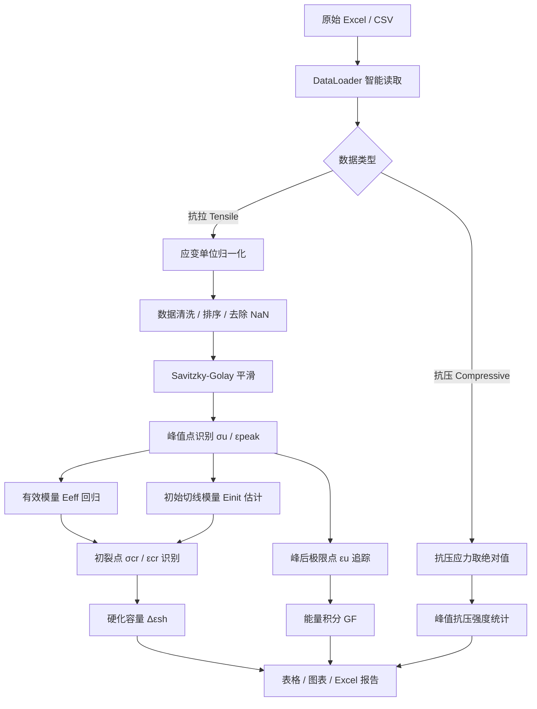
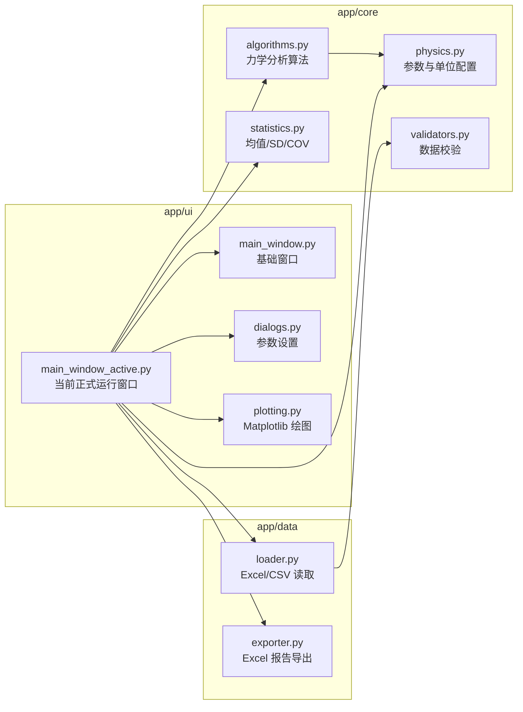
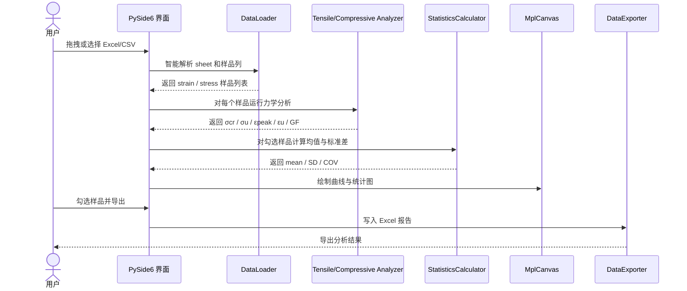
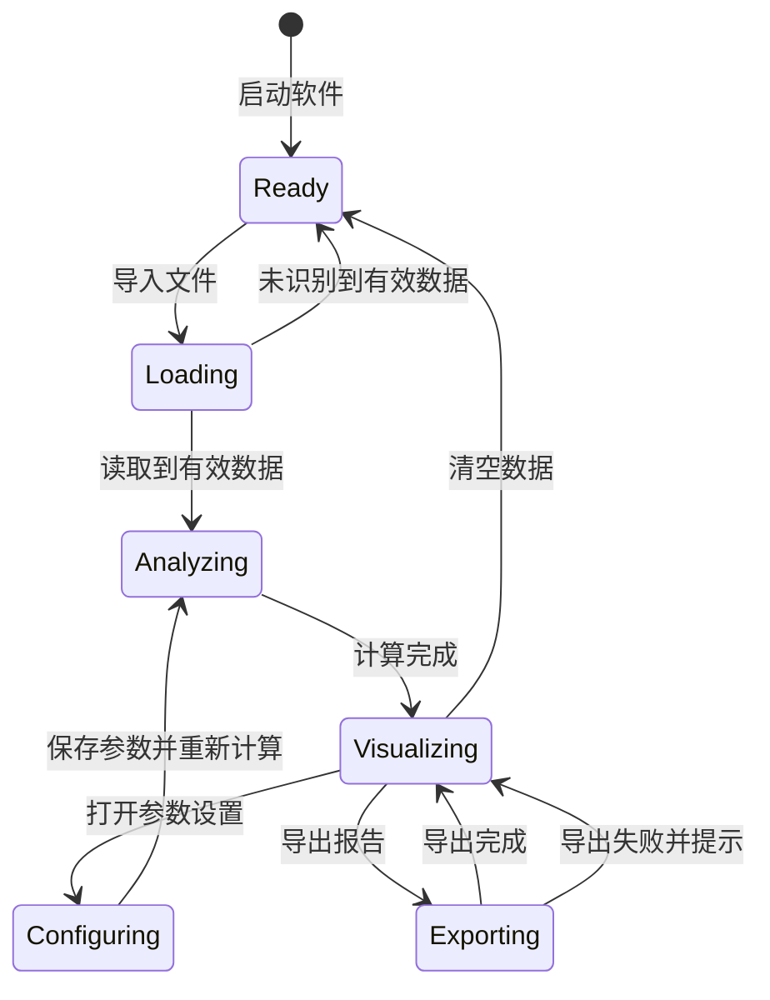

# ECC Analyzer Pro

<div align="center">


**面向 ECC / SHCC 拉伸与抗压试验数据的科研分析工具。**

用于曲线批量读取、应变单位统一、初裂点识别、峰后极限应变计算、能量指标统计与 Excel 报告导出。

[快速开始](#快速开始) · [数据格式](#数据格式) · [计算逻辑与公式](#计算逻辑与公式) · [软件架构](#软件架构) · [界面说明](#界面说明) · [用户指南](USER_GUIDE.md)

</div>

---

## 项目定位

`ECC Analyzer Pro` 是一个个人研究过程中逐步整理出来的 ECC / SHCC 力学数据分析工具。它主要用于处理抗拉应力–应变曲线和抗压强度数据，目标是让论文数据处理过程更加统一、透明和可复现。

目前软件重点支持两类数据：

1. **抗拉 stress-strain 曲线**：自动识别初裂强度、峰值强度、峰值应变、极限应变、硬化容量与能量指标；
2. **抗压强度或抗压曲线**：支持完整曲线，也支持“组名 + 多个强度值”的汇总表。

这个项目的定位不是替代 Origin、Excel 或商业试验软件，而是作为一个更贴近 ECC / SHCC 论文数据处理流程的 `research analysis assistant`，用于减少人工判读差异，提高同一批试验数据之间的可比性。

---

## 快速开始

### 1. 安装依赖

```bash
python -m pip install -r requirements.txt
```

如果使用 conda 环境，例如：

```bash
conda activate ecc_sim
python -m pip install -r requirements.txt
```

### 2. 启动软件

```bash
python main.py
```

当前正式运行入口为：

```text
main.py → app/ui/main_window_active.py
```

### 3. 运行核心测试

```bash
python scripts/smoke_test.py
```

若输出如下内容，说明核心分析模块可以正常运行：

```text
Smoke test passed.
```

---

## 数据格式

### 抗拉数据：两列一组

每个试件建议使用相邻两列：第一列为应变，第二列为应力。

| A | B | C | D |
|---|---:|---|---:|
| FSC-AIR-1 |  | FSC-AIR-2 |  |
| Strain (%) | Stress (MPa) | Strain (%) | Stress (MPa) |
| 0.000 | 0.00 | 0.000 | 0.00 |
| 0.050 | 1.20 | 0.048 | 1.15 |
| 0.100 | 1.75 | 0.096 | 1.70 |
| 0.500 | 2.20 | 0.510 | 2.10 |

程序会自动寻找数值开始行，并尽量将数值行上方的有效文本识别为样品名。

### 抗压数据：汇总强度表

如果已经整理出每个试件的峰值抗压强度，可以使用以下格式：

| Group | Test 1 | Test 2 | Test 3 |
|---|---:|---:|---:|
| ECC-M45 | 45.2 | 46.8 | 44.9 |
| ECC-M60 | 58.5 | 61.2 | 59.7 |

程序支持 `Stress / Strength / 应力 / 强度` 等表头关键词。

### 抗压数据：完整曲线

完整抗压曲线也可以采用“两列一组”的格式。若原始抗压应力为负值，程序默认将其转换为正的强度大小。

---

## 应变单位逻辑

软件内部统一使用小数应变参与计算，结果显示和导出时再转换为百分数。

在 **参数设置 → 输入应变单位** 中有三种模式：

| 模式 | 适用情况 | 示例 |
|---|---|---|
| `Auto` | 不确定单位时自动判断 | 默认阈值 0.2 |
| `Percent` | Excel 表头写 `Strain (%)` | `0.5` 表示 `0.5%` |
| `Decimal` | DIC 或程序导出的小数应变 | `0.005` 表示 `0.5%` |

建议在表头明确带 `%` 时选择 **Percent**，在 DIC 或程序导出的小数应变数据中选择 **Decimal**。

---

## 计算逻辑与公式

### 总体计算流程



---

### 1. 应变单位归一化

当输入模式为 `Percent`：

$$
\varepsilon = \varepsilon_{input} / 100
$$

当输入模式为 `Decimal`：

$$
\varepsilon = \varepsilon_{input}
$$

当输入模式为 `Auto`，程序先计算输入应变绝对值的最大值：

$$
\varepsilon_{max} = \max |\varepsilon_{input}|
$$

若 `ε_max > ε_threshold`，则按百分数处理：

$$
\varepsilon = \varepsilon_{input} / 100
$$

若 `ε_max ≤ ε_threshold`，则按小数应变处理：

$$
\varepsilon = \varepsilon_{input}
$$

默认阈值为：

$$
\varepsilon_{threshold} = 0.2
$$

---

### 2. 峰值强度与峰值应变

峰值点按平滑后的应力曲线识别：

$$
i_{peak} = \arg\max_i \sigma_i
$$

峰值强度为：

$$
\sigma_u = \sigma(i_{peak})
$$

峰值应变为：

$$
\varepsilon_{peak} = 100 \times \varepsilon(i_{peak})
$$

其中，`ε_peak` 表示峰值强度对应的应变，不等同于峰后极限应变 `ε_u`。

---

### 3. 有效模量 `E_eff`

有效模量采用峰值应力比例区间内的线性回归计算。默认区间为 `10%–40% σ_u`：

$$
\sigma = E_{eff}\varepsilon + b
$$

拟合区间为：

$$
r_{low}\sigma_u \leq \sigma_i \leq r_{high}\sigma_u
$$

默认比例为：

$$
r_{low} = 0.10, \quad r_{high} = 0.40
$$

线性回归斜率可表示为：

$$
E_{eff} = \frac{\sum(\varepsilon_i - \bar{\varepsilon})(\sigma_i - \bar{\sigma})}{\sum(\varepsilon_i - \bar{\varepsilon})^2}
$$

工程单位换算为：

$$
E_{eff}(GPa) = E_{eff}(MPa) / 1000
$$

---

### 4. 初始切线模量 `E_init`

初始切线模量用于辅助初裂点判断。局部切线模量定义为：

$$
E_{tangent,i} = \Delta\sigma_i / \Delta\varepsilon_i
$$

程序从早期有效切线刚度中估计 `E_init`：

$$
E_{init} = stat(E_{tangent,i})
$$

这里的 `stat` 表示对早期切线刚度的稳健统计，用于降低起始噪声对初裂判定的影响。

---

### 5. 初裂强度 `σ_cr`

初裂点采用多条件联合判定，而不是单一阈值。

**条件 A：相对线性段发生明显偏离**

$$
|\sigma_i - \hat{\sigma}_i| > \max(\delta_{base}, \delta_{ratio}\sigma_u)
$$

其中：

$$
\hat{\sigma}_i = E_{eff}\varepsilon_i + b
$$

**条件 B：局部切线刚度出现下降**

$$
E_{tangent,i} < \eta_E E_{init}
$$

**条件 C：当前应力超过最低应力比例**

$$
\sigma_i > r_{min}\sigma_u
$$

程序从前向后扫描候选点，将第一个同时满足 A、B、C 的位置记为初裂点：

$$
i_{cr} = first(i)
$$

$$
A_i \land B_i \land C_i = true
$$

对应初裂强度与初裂应变为：

$$
\sigma_{cr} = \sigma(i_{cr})
$$

$$
\varepsilon_{cr} = 100 \times \varepsilon(i_{cr})
$$

---

### 6. 峰后极限应变 `ε_u`

ECC / SHCC 的峰值点和变形终点并不一定重合。程序在峰值点之后继续追踪应力下降过程，寻找峰后极限点。

设峰后失效比例为 `r_u`：

$$
r_u = 0.85
$$

峰后候选点需满足：

$$
i_u > i_{peak}
$$

$$
\sigma_i < r_u\sigma_u
$$

通过峰后连续性检查后，对应极限应变为：

$$
\varepsilon_u = 100 \times \varepsilon(i_u)
$$

若曲线没有明显峰后下降，程序会返回相对保守的曲线末端极限值。

---

### 7. 应变硬化容量 `Δε_sh`

应变硬化容量用于描述初裂之后到极限点之间的变形发展空间：

$$
\Delta\varepsilon_{sh} = \varepsilon_u - \varepsilon_{cr}
$$

该指标可用于比较不同配合比或不同养护条件下 ECC / SHCC 的应变硬化能力。

---

### 8. 能量指标与断裂能相关量 `G_F`

程序首先计算 `0 → ε_u` 范围内的应力–应变曲线面积：

$$
W = \int_0^{\varepsilon_u} \sigma(\varepsilon)d\varepsilon
$$

数值计算中采用 Simpson 积分近似：

$$
W \approx Simpson(\sigma, \varepsilon)
$$

结合标距 `L_0`，得到断裂能相关指标：

$$
G_F = L_0 \int_0^{\varepsilon_u} \sigma(\varepsilon)d\varepsilon
$$

单位关系可表示为：

$$
MPa \cdot mm = N/mm = kJ/m^2
$$

该 `G_F` 更适合作为同一试验制度和同一标距条件下的对比指标。

---

### 9. 平台稳定性 `CV_σ`

平台稳定性用于表征多缝开展阶段的应力波动程度：

$$
CV_{\sigma} = s_{\sigma} / \bar{\sigma}
$$

其中：

$$
s_{\sigma} = \sqrt{\frac{1}{n-1}\sum_{i=1}^{n}(\sigma_i - \bar{\sigma})^2}
$$

`CV_σ` 越小，表示平台区应力波动越小。该指标对曲线噪声、平滑窗口和平台区定义较敏感，适合作为辅助分析指标。

---

### 10. 抗压强度统计

抗压模式下，如果原始应力为负值，程序默认转为正的强度大小：

$$
\sigma_{c,i} = |\sigma_i|
$$

单个试件峰值抗压强度为：

$$
f_c = \max_i \sigma_{c,i}
$$

同组样品的平均值、标准差和变异系数分别为：

$$
\bar{f}_c = \frac{1}{n}\sum_{i=1}^{n} f_{c,i}
$$

$$
SD = \sqrt{\frac{1}{n-1}\sum_{i=1}^{n}(f_{c,i} - \bar{f}_c)^2}
$$

$$
COV = \frac{SD}{\bar{f}_c} \times 100\%
$$

---

## 算法伪代码

```python
# Tensile analysis pipeline
strain, stress = load_curve_from_excel(file)
strain = normalize_strain_unit(strain, mode="auto|percent|decimal")
stress_smooth = savgol_filter(stress, window=SMOOTH_WINDOW)

idx_peak = argmax(stress_smooth)
sigma_u = stress_smooth[idx_peak]
epsilon_peak = strain[idx_peak] * 100

fit_region = where((stress_smooth >= 0.10 * sigma_u) &
                   (stress_smooth <= 0.40 * sigma_u))
E_eff, intercept = linear_regression(strain[fit_region], stress_smooth[fit_region])
E_init = robust_initial_tangent_modulus(strain, stress_smooth)

for i in candidate_points_before_peak:
    deviation = abs(stress_smooth[i] - (E_eff * strain[i] + intercept))
    stiffness_drop = tangent_modulus[i] < CRACK_STIFFNESS_CONSTRAINT * E_init
    stress_enough = stress_smooth[i] > CRACK_MIN_STRESS_RATIO * sigma_u
    if deviation > max(CRACK_TOLERANCE_BASE, CRACK_TOLERANCE_RATIO * sigma_u) \
       and stiffness_drop \
       and stress_enough:
        idx_cr = i
        break

idx_u = find_post_peak_limit(stress_smooth, idx_peak, ratio=ULTIMATE_STRAIN_RATIO)
G_F = gauge_length * simpson_integral(stress_smooth[:idx_u], strain[:idx_u])
```

---

## 参数配置关系

软件参数保存在用户目录下的配置文件中：

```text
~/.ecc_analyzer_config.json
```

参数结构可概括为：

```yaml
geometry:
  gauge_length_mm: 80.0

strain_unit:
  mode: auto        # auto | percent | decimal
  auto_threshold: 0.2

modulus:
  elastic_lower_ratio: 0.10
  elastic_upper_ratio: 0.40

first_cracking:
  crack_tolerance_base: 0.03
  crack_tolerance_ratio: 0.01
  stiffness_constraint: 0.85
  min_stress_ratio: 0.10

post_peak:
  ultimate_strain_ratio: 0.85

visualization:
  smoothing_window: 15
  line_width: 1.5
  theme_color: scientific_blue
```

---

## 软件架构

### 模块依赖关系



### 用户操作时序



### 状态逻辑



### 当前项目结构

```text
ECC_Analyzer_Pro/
├── main.py                         # 程序入口
├── README.md                       # 项目说明
├── USER_GUIDE.md                   # 用户指南
├── requirements.txt
├── scripts/
│   └── smoke_test.py               # 核心算法测试
└── app/
    ├── core/
    │   ├── algorithms.py           # 拉伸/抗压核心算法
    │   ├── physics.py              # 全局配置与默认参数
    │   ├── statistics.py           # 均值/SD/COV 统计
    │   └── validators.py           # 数据校验
    ├── data/
    │   ├── loader.py               # Excel/CSV 读取
    │   └── exporter.py             # Excel 导出
    └── ui/
        ├── main_window.py          # 基础窗口实现
        ├── main_window_active.py   # 当前正式运行窗口
        ├── plotting.py             # Matplotlib 绘图
        └── dialogs.py              # 参数设置窗口
```

---

## 界面说明

### 顶部区域

- `模式`：选择抗拉 Tensile 或抗压 Compressive；
- `基础结果`：显示常用工程指标；
- `高级分析`：显示更偏科研解释的指标；
- `导出报告`：导出当前勾选样品；
- `参数设置`：修改单位、初裂、模量、极限点和绘图参数；
- `清空`：清空当前数据。

### Basic Results

抗拉基础结果表格显示 5 个指标：

| 指标 | 含义 |
|---|---|
| `E_eff` | 有效模量 |
| `σ_cr` | 初裂强度 |
| `σ_u` | 峰值拉伸强度 |
| `ε_peak` | 峰值应变 |
| `ε_u` | 峰后极限应变 |

### Advanced Analysis

| 指标 | 含义 |
|---|---|
| `E_init` | 初始切线模量估计 |
| `G_F` | 标距换算后的能量指标 |
| `Δε_sh` | 应变硬化容量 |
| `CV_σ` | 硬化平台稳定性 |

---

## 导出说明

导出的抗拉 Excel 会包含：

```text
E_eff, σ_cr, σ_u, ε_peak, ε_u, E_init, E_v, G_F, Δε_sh, CV_σ
```

导出的抗压 Excel 会包含：

```text
Sample Group, σ_mean, SD, COV, N
```

如果目标 Excel 文件正在打开，软件会提示导出失败。

---

## 复现实验建议

如果用于论文或组会汇报，建议同时保存：

- 原始 Excel / CSV；
- 导出的分析结果；
- `~/.ecc_analyzer_config.json`；
- 当前 GitHub commit；
- 参数设置界面的关键参数截图。

建议在论文方法部分说明以下信息：

```json
{
  "software": "ECC Analyzer Pro",
  "strain_unit": "percent",
  "gauge_length_mm": 80.0,
  "elastic_fit_range": [0.10, 0.40],
  "ultimate_strain_ratio": 0.85,
  "smooth_window": 15
}
```

---

## 引用方式

```bibtex
@software{ECC_Analyzer_Pro,
  author = {Li, Qing},
  title = {ECC Analyzer Pro: A research-oriented tool for ECC/SHCC tensile and compressive data analysis},
  year = {2026},
  publisher = {GitHub},
  url = {https://github.com/liqinglq666/ECC_Analyzer_Pro}
}
```

---

## 说明

这是一个围绕 ECC / SHCC 试验数据处理需求持续整理的科研工具。后续会根据真实试验数据、论文写作需求和使用反馈继续完善。
