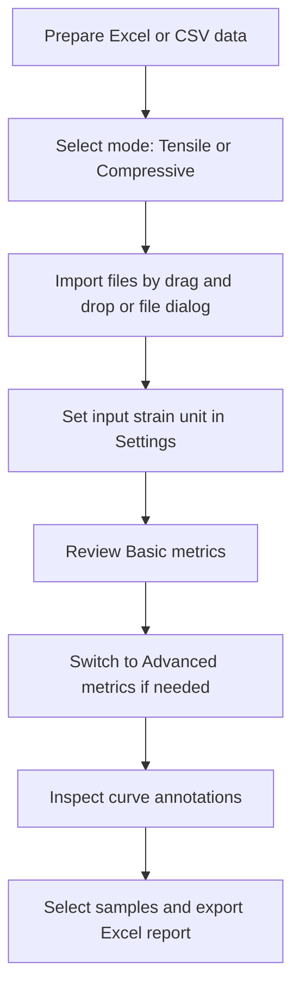
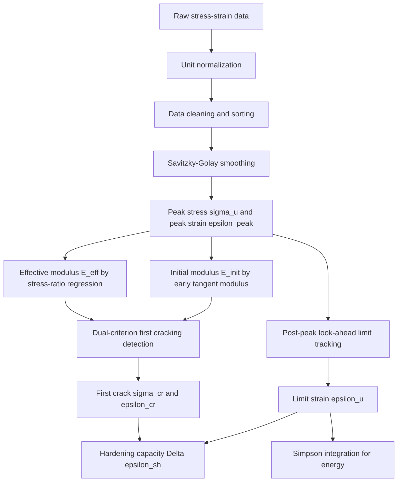

# ECC Analyzer Pro

<div align="center">


Automated mechanics analysis software for ECC / SHCC tensile and compressive test data.

面向 ECC / SHCC 拉伸与抗压试验数据的桌面科研分析工具，支持批量导入、自动特征点识别、统计对比、曲线可视化与 Excel 导出。

[Quick Start](#quick-start) · [Data Format](#data-format) · [Algorithm](#algorithm-overview) · [User Guide](USER_GUIDE.md) · [Smoke Test](#smoke-test)

</div>

---

## What this project does

ECC Analyzer Pro focuses on repeatable mechanics analysis rather than manual point-picking. It is designed for common ECC / SHCC laboratory workflows:

- **Tensile mode**: batch-read stress-strain curves, detect first cracking, peak stress, peak strain, post-peak limit strain, hardening capacity and energy indices.
- **Compressive mode**: read either full compressive curves or row-based compressive strength summaries.
- **Statistics view**: compare groups using mean and standard deviation.
- **Curve view**: overlay curves, inspect key points and export publication-ready figures.
- **Excel export**: export raw curves and calculated metrics into structured reports.

---

## Quick Start

### 1. Install dependencies

```bash
python -m pip install -r requirements.txt
```

The main dependencies are PySide6, Matplotlib, Pandas, NumPy, SciPy, OpenPyXL and mplcursors.

### 2. Run the application

```bash
python main.py
```

The application starts a PySide6 desktop GUI. The default entry point loads a patched main window first, so the visible UI uses the latest export and metric-label behavior.

### 3. Run the core smoke test

```bash
python scripts/smoke_test.py
```

This test does not open the GUI. It checks whether the tensile and compressive analyzers can run on representative arrays and whether negative compressive stress is converted to positive strength.

---

## Recommended workflow



The most important setting is **Input Strain Unit**. Do not skip it when your strain column may be stored as percent values.

---

## Data Format

### Tensile mode: column-pair curve format

Each specimen should be stored as a pair of columns: strain and stress.

| Sample A |  | Sample B |  |
|---|---:|---|---:|
| Strain | Stress | Strain | Stress |
| % or decimal | MPa | % or decimal | MPa |
| 0.000 | 0.00 | 0.000 | 0.00 |
| 0.050 | 1.20 | 0.048 | 1.15 |
| 0.100 | 1.75 | 0.096 | 1.70 |

The software searches each pair of columns for numeric stress-strain data and uses the nearest valid text above the numeric rows as the specimen name.

### Compressive mode: row-based summary format

For compressive strength summaries, one row can contain one group name and multiple strength values.

| Group | Test 1 | Test 2 | Test 3 |
|---|---:|---:|---:|
| ECC-M45 | 45.2 | 46.8 | 44.9 |
| ECC-M60 | 58.5 | 61.2 | 59.7 |

Negative compressive stress values such as `-42.5` are treated as positive strength magnitudes by default.

### Compressive mode: full curve format

Full compressive curves can also use the same column-pair format as tensile mode. The stress magnitude is used when negative compression convention is detected.

---

## Strain unit logic

ECC datasets often mix two strain conventions:

| Spreadsheet value | Meaning in percent mode | Meaning in decimal mode |
|---:|---:|---:|
| `0.5` | 0.5% strain | 50% strain |
| `0.005` | 0.005% strain | 0.5% strain |

ECC Analyzer Pro now exposes this directly in **Settings → Input Strain Unit**:

- **Auto - infer by threshold**: values above `Auto Percent Threshold` are interpreted as percent strain.
- **Percent - 0.5 means 0.5%**: input values are divided by 100 before analysis.
- **Decimal - 0.005 means 0.5%**: input values are used directly.

Default auto threshold is `0.2`. Therefore, in auto mode, `0.5` is interpreted as `0.5%`, while `0.005` remains decimal strain.

For most exported Excel files whose header says `Strain (%)`, choose **Percent**.

---

## Algorithm Overview



### Effective modulus, `E_eff`

`E_eff` is calculated by linear regression within a configurable stress window, defaulting to 10%–40% of peak stress.

### Initial modulus, `E_init`

`E_init` is extracted from the early tangent modulus curve after smoothing and physical filtering. It is mainly used as a robust stiffness reference for first-crack detection.

### First cracking strength, `σ_cr`

First cracking is detected using a coupled condition:

```text
linear deviation > max(CRACK_TOLERANCE_BASE, CRACK_TOLERANCE_RATIO × σ_u)
AND tangent stiffness < CRACK_STIFFNESS_CONSTRAINT × E_init
AND stress > CRACK_MIN_STRESS_RATIO × σ_u
```

This avoids relying on a single noisy deviation threshold.

### Peak strain versus limit strain

The software distinguishes two strain indices:

- **Peak Strain, `ε_peak`**: strain at maximum stress `σ_u`.
- **Limit Strain, `ε_u`**: post-peak limit point where stress stays below the configured ratio of `σ_u` after a look-ahead check.

This distinction is important for ECC because the material may continue deforming after peak stress due to fiber bridging and multiple cracking.

### Hardening capacity

```text
Δε_sh = ε_u - ε_cr
```

### Fracture energy proxy

```text
G_F = L0 × ∫σ(ε)dε
```

The integral is computed up to the limit point `ε_u` using Simpson integration. `L0` is the user-defined gauge length in millimeters.

---

## UI Guide

### Header controls

- **Mode**: switch between `Tensile (抗拉)` and `Compressive (抗压)`.
- **Basic Results**: shows engineering-facing metrics.
- **Advanced Analysis**: shows research-facing metrics.
- **Export**: exports selected samples to Excel.
- **Settings**: adjusts unit, modulus, cracking, failure and plotting parameters.
- **Clear**: clears all imported data.

### Basic tensile table

The Basic table now separates peak and limit strain:

| Column | Meaning |
|---|---|
| `E_eff` | Effective modulus from regression |
| `σ_cr` | First cracking strength |
| `σ_u` | Peak tensile stress |
| `ε_peak` | Strain at peak stress |
| `ε_u` | Post-peak limit strain |

### Advanced tensile table

| Column | Meaning |
|---|---|
| `E_init` | Initial tangent modulus estimate |
| `G_F` | Gauge-length-scaled energy index |
| `Δε_sh` | Strain-hardening capacity |
| `CV_σ` | Plateau stress stability coefficient |

---

## Settings

The settings file is saved in the user home directory:

```text
~/.ecc_analyzer_config.json
```

Important parameters:

| Parameter | Default | Meaning |
|---|---:|---|
| `GAUGE_LENGTH_MM` | 80.0 | Gauge length used for energy scaling |
| `STRAIN_UNIT` | auto | Input strain interpretation mode |
| `STRAIN_PERCENT_THRESHOLD` | 0.2 | Auto-mode threshold for percent strain |
| `ELASTIC_LOWER_RATIO` | 0.10 | Lower bound for modulus regression |
| `ELASTIC_UPPER_RATIO` | 0.40 | Upper bound for modulus regression |
| `CRACK_TOLERANCE_BASE` | 0.05 | Base deviation tolerance for first cracking |
| `CRACK_TOLERANCE_RATIO` | 0.01 | Peak-stress-scaled deviation tolerance |
| `CRACK_STIFFNESS_CONSTRAINT` | 0.85 | Tangent stiffness degradation criterion |
| `CRACK_MIN_STRESS_RATIO` | 0.10 | Minimum stress level for crack detection |
| `ULTIMATE_STRAIN_RATIO` | 0.85 | Post-peak stress-retention threshold |
| `SMOOTH_WINDOW` | 15 | Savitzky-Golay smoothing window |

---

## Exported Excel report

Tensile export includes:

- raw stress-strain curves;
- `E_eff`, `σ_cr`, `σ_u`, `ε_peak`, `ε_u`;
- `E_init`, strain energy, `G_F`, `Δε_sh`, `CV_σ`;
- group mean, standard deviation and coefficient of variation.

Compressive export includes:

- sample group;
- mean compressive strength;
- standard deviation;
- coefficient of variation;
- sample count.

If export fails, the UI now reports failure instead of showing a false success message. Close the target Excel file and try again.

---

## Project structure

```text
ECC_Analyzer_Pro/
├── main.py
├── requirements.txt
├── README.md
├── USER_GUIDE.md
├── scripts/
│   └── smoke_test.py
└── app/
    ├── core/
    │   ├── algorithms.py
    │   ├── physics.py
    │   ├── statistics.py
    │   └── validators.py
    ├── data/
    │   ├── loader.py
    │   └── exporter.py
    └── ui/
        ├── main_window.py
        ├── main_window_patch.py
        ├── plotting.py
        └── dialogs.py
```

---

## Troubleshooting

### The calculated strain is 100× too large or too small

Open **Settings → Input Strain Unit** and choose the correct mode. Use **Percent** when the Excel column is labeled `Strain (%)`.

### Export says failed

Close the target Excel file and confirm the output folder is writable.

### No valid tensile data found

Check whether each specimen uses two adjacent columns: strain first, stress second.

### Compressive values are negative in the original file

This is supported. Negative compressive stress is converted to positive strength magnitude by default.

---

## Citation

If you use this software in academic work, please cite it as research software:

```bibtex
@software{ECC_Analyzer_Pro,
  author = {Li, Qing},
  title = {ECC Analyzer Pro: Automated mechanics analysis software for ECC/SHCC tensile and compressive data},
  year = {2026},
  publisher = {GitHub},
  url = {https://github.com/liqinglq666/ECC_Analyzer_Pro}
}
```

---

## License note

No standalone license file is currently included in this repository. Please contact the author before redistribution or commercial use.
