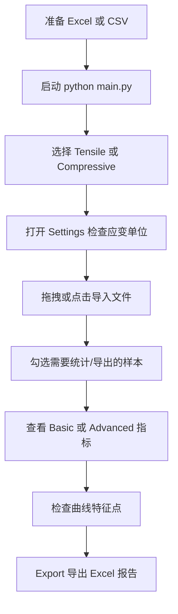

# ECC Analyzer Pro 用户指南

这份指南面向真实使用者：你只需要准备 Excel / CSV 数据，选择正确模式和应变单位，然后导入、检查、导出即可。

---

## 1. 启动软件

在项目根目录打开终端：

```bash
conda activate ecc_sim
python main.py
```

如果只是想检查核心算法是否能运行，不打开 GUI，可以执行：

```bash
python scripts\smoke_test.py
```

看到 `Smoke test passed.` 即表示核心分析模块可以正常导入和运行。

---

## 2. 总体操作流程



---

## 3. Tensile 抗拉数据模板

### 推荐格式：每个样本两列

每个试件使用相邻两列：第一列应变，第二列应力。

| A | B | C | D |
|---|---:|---|---:|
| FSC-AIR-1 |  | FSC-AIR-2 |  |
| Strain (%) | Stress (MPa) | Strain (%) | Stress (MPa) |
| 0.000 | 0.00 | 0.000 | 0.00 |
| 0.050 | 1.20 | 0.048 | 1.15 |
| 0.100 | 1.75 | 0.096 | 1.70 |
| 0.500 | 2.20 | 0.510 | 2.10 |

软件会自动寻找数值开始行，并把数值行上方最近的有效文本作为样品名。

### 注意事项

- 应变列和应力列必须相邻。
- 一个样品占两列，多个样品依次排列。
- 不要把时间、位移、载荷等列夹在应变和应力中间。
- 应力单位默认按 MPa 处理。

---

## 4. Compressive 抗压数据模板

抗压有两种常见格式。

### 格式 A：汇总强度表

适合你已经从试验机得到每个试件的峰值抗压强度。

| Group | Test 1 | Test 2 | Test 3 |
|---|---:|---:|---:|
| ECC-M45 | 45.2 | 46.8 | 44.9 |
| ECC-M60 | 58.5 | 61.2 | 59.7 |

也支持这种带序号的格式：

| No. | Group | Strength 1 | Strength 2 |
|---:|---|---:|---:|
| 1 | ECC-M45 | 45.2 | 46.8 |
| 2 | ECC-M60 | 58.5 | 61.2 |

### 格式 B：完整抗压曲线

如果你有完整曲线，也可以用和抗拉相同的两列格式：

| Sample A |  | Sample B |  |
|---|---:|---|---:|
| Strain (%) | Stress (MPa) | Strain (%) | Stress (MPa) |
| 0.000 | 0.00 | 0.000 | 0.00 |
| 0.050 | -5.20 | 0.050 | -4.95 |
| 0.100 | -12.0 | 0.100 | -11.7 |

负号抗压应力是支持的。软件默认会把抗压应力转成正的强度大小。

---

## 5. 应变单位怎么选

这是最容易算错的地方。

打开 **Settings → Input Strain Unit**，你会看到三个选项。

### 选项 1：Auto - infer by threshold

自动判断。默认阈值是 `0.2`。

- 如果最大应变值大于 `0.2`，软件认为你的输入是百分数。
- 如果最大应变值小于等于 `0.2`，软件认为你的输入是小数应变。

例如：

| 输入值 | Auto 判断 | 内部计算值 |
|---:|---|---:|
| 0.5 | 0.5% | 0.005 |
| 4.0 | 4.0% | 0.040 |
| 0.005 | 小数应变 | 0.005 |

### 选项 2：Percent - 0.5 means 0.5%

如果 Excel 表头写的是 `Strain (%)`，一般选这个。

| Excel 中的值 | 实际含义 | 内部计算值 |
|---:|---:|---:|
| 0.5 | 0.5% | 0.005 |
| 1.0 | 1.0% | 0.010 |
| 4.0 | 4.0% | 0.040 |

### 选项 3：Decimal - 0.005 means 0.5%

如果你的 DIC 或机器导出的是小数应变，选这个。

| Excel 中的值 | 实际含义 | 内部计算值 |
|---:|---:|---:|
| 0.005 | 0.5% | 0.005 |
| 0.010 | 1.0% | 0.010 |
| 0.040 | 4.0% | 0.040 |

### 推荐

如果你不确定，但表头写了 `%`，选 **Percent**。不要完全依赖 Auto。

---

## 6. Basic Results 指标解释

抗拉 Basic 视图现在显示 5 个指标：

| 指标 | 含义 |
|---|---|
| `E_eff` | 有效模量，由峰值应力 10%–40% 区间线性回归得到 |
| `σ_cr` | 初裂强度，满足线性偏离、刚度衰减、最低应力三重条件 |
| `σ_u` | 峰值拉伸应力 |
| `ε_peak` | 峰值应力对应的应变 |
| `ε_u` | 峰后极限/失效应变，按应力跌落阈值和 look-ahead 机制确定 |

注意：`ε_peak` 和 `ε_u` 不是一个东西。ECC 峰值后可能还会继续变形，所以需要分开显示。

---

## 7. Advanced Analysis 指标解释

| 指标 | 含义 |
|---|---|
| `E_init` | 初始切线模量估计，主要用于辅助初裂判断 |
| `G_F` | 标距换算后的能量指标 |
| `Δε_sh` | 应变硬化容量，计算为 `ε_u - ε_cr` |
| `CV_σ` | 硬化平台稳定性，越小表示平台波动越低 |

---

## 8. Settings 参数说明

| 参数 | 建议值 | 说明 |
|---|---:|---|
| Gauge Length L₀ | 实测标距 | 会影响 `G_F` |
| Input Strain Unit | Percent 或 Decimal | 决定应变单位解释 |
| Auto Percent Threshold | 0.2 | Auto 模式判断阈值 |
| Elastic Fit Lower Ratio | 0.10 | 模量拟合起点，按峰值应力比例 |
| Elastic Fit Upper Ratio | 0.40 | 模量拟合终点，按峰值应力比例 |
| Crack Tolerance Base | 0.05 MPa | 初裂线性偏离基础容差 |
| Crack Tolerance Ratio | 0.01 | 按峰值应力放大的偏离容差 |
| Stiffness Constraint | 0.85 | 切线刚度衰减阈值 |
| Min Stress Ratio | 0.10 | 初裂检测最低应力比例 |
| Rupture Ratio | 0.85 | 峰后跌落至峰值多少比例视为极限点 |
| Smoothing Window | 15 | 平滑窗口，奇数更合适 |

Settings 点击 OK 后会保存到：

```text
~/.ecc_analyzer_config.json
```

在 Windows 上通常类似：

```text
C:\Users\你的用户名\.ecc_analyzer_config.json
```

---

## 9. 导出 Excel

点击 **Export** 会导出当前勾选样品。

### 抗拉导出内容

- Raw Data (Curves)：原始曲线，应变统一导出为 `%`。
- Tensile Analysis：各样品计算结果、均值、标准差和 COV。

核心列包括：

```text
E_eff, σ_cr, σ_u, ε_peak, ε_u, E_init, E_v, G_F, Δε_sh, CV_σ
```

### 抗压导出内容

```text
Sample Group, σ_mean, SD, COV, N
```

### 导出失败怎么办

最常见原因：目标 Excel 文件已经打开。

处理方法：

1. 关闭同名 Excel 文件。
2. 确认保存目录可写。
3. 换一个新文件名再导出。

---

## 10. 常见错误与解决方案

### 问题 1：应变结果大了 100 倍

原因：你的数据是百分数，例如 `0.5` 表示 `0.5%`，但软件按小数应变理解了。

解决：Settings → Input Strain Unit → 选择 **Percent**。

### 问题 2：模量特别小

原因通常也是应变单位错了。

解决：检查 `Input Strain Unit`。如果 Excel 表头是 `Strain (%)`，优先选 Percent。

### 问题 3：导入后提示 No valid data found

检查：

- 文件是不是 `.xlsx / .xls / .csv`。
- 抗拉数据是不是两列一组。
- 前 15 行内是否能找到数值型应变和应力。
- 应力列是否全是 0 或空值。

### 问题 4：抗压结果没有读出来

如果是汇总表，建议表头使用：

```text
Group, Strength 1, Strength 2, Strength 3
```

或：

```text
Group, Stress 1, Stress 2, Stress 3
```

软件会识别 `stress / strength / 应力 / 强度` 等关键词。

### 问题 5：导出 Excel 失败

关闭正在打开的目标 Excel 文件，再导出。

### 问题 6：曲线标注挡住图

曲线图中的标注框可以拖动，也可以右键复制或保存图像。

---

## 11. 建议的论文数据处理规范

为了保证论文结果可复现，建议每次分析时记录：

```text
Input Strain Unit
Gauge Length L0
Elastic Fit Lower / Upper Ratio
Crack Tolerance Base / Ratio
Stiffness Constraint
Rupture Ratio
Smoothing Window
```

同时保留：

- 原始 Excel 数据；
- 导出的分析报告；
- `.ecc_analyzer_config.json` 配置文件；
- 软件 GitHub commit 版本。

---

## 12. VS Code 推荐运行命令

```bash
git pull origin main
conda activate ecc_sim
python -m pip install -r requirements.txt
python scripts\smoke_test.py
python main.py
```

如果你只想更新代码，不运行：

```bash
git pull origin main
```
